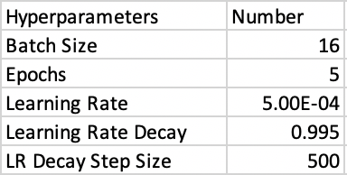
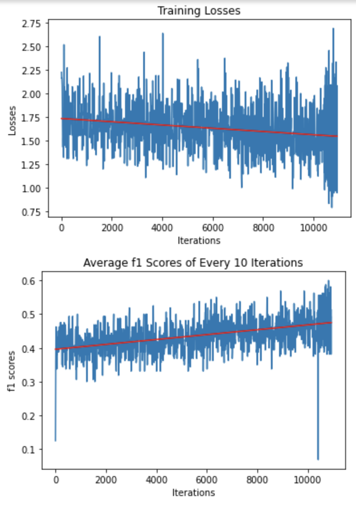

# Discourse-classification

## Dataset
Dataset is using Google research coarse discourse dataset: [here](https://github.com/google-research-datasets/coarse-discourse). 

To obtain the text information, I connected to the Reddit API, which requires the pip download of praw.

There are 10 types of discourse actions in the dataset: question, answer, announcement, agreement, appreciation, disagreement, negative reaction, elaboration, humor, and others.

### Data Clean-Up
1. Delete all the urls
2. Lower all the characters
3. Delete all the non-letter characters
4. Tokenize all words

The reason that I didn't delete the stop word is that some stop words may be useful in classifying discourse actions. For example, "Are you happy?", if the stop words are removed, it will just be "happy". It will be much harder to identify if it is an question or an announcement. I saved the clean-up text and its corresponding discourse actions in a .csv file. Below is the basic infos of the dataset. 

  

## Model & Training
The model I used is the attention based BiLSTM. I didn't train my own embedding layer. Instead, I used  the GoogleNews pretrained embedding model, in which every word outputs a 300 dimensions vector. The model contains 32 features in the hidden state and 1 recurrent layer. The training hyperparameters are shown below. The dataset is plit into training and testing set as ratio of 0.8 : 0.2. The loss function is the cross entropy loss and the model is trained on Google Colab.

  

Below are the training Process. The first plot is the training loss and the second plot is the f1 scores. Both plots are calculated in every 10 iterations. The red lines are the plot trend, which calculated by linear regression.

  

After the training finished, the model is tested using the test dataset, and achieve 0.49 f1 scores. 
